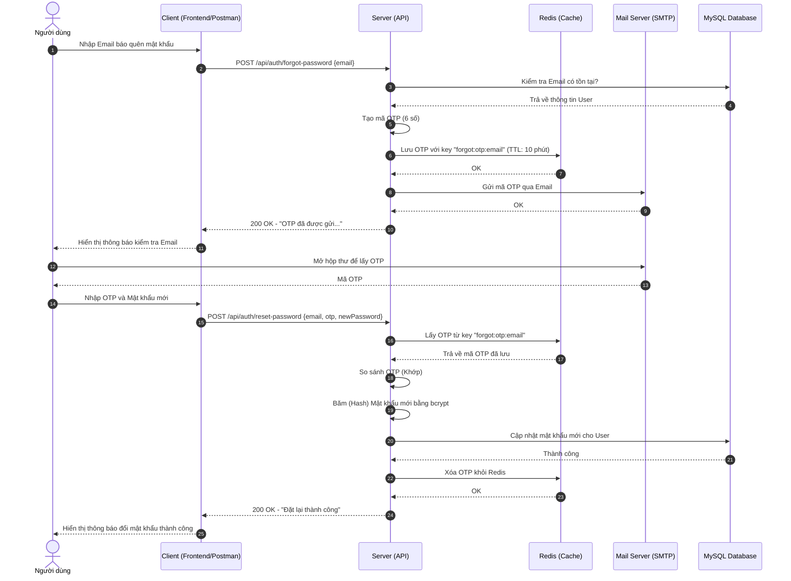
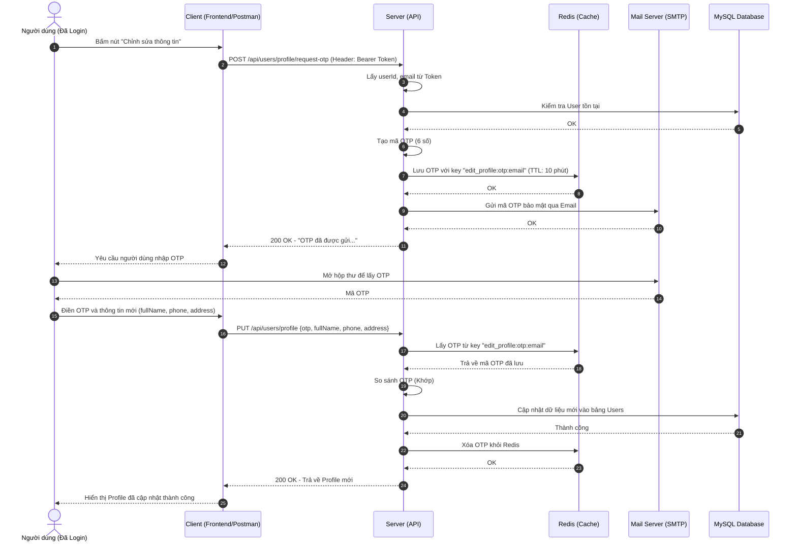

# UML Diagrams for UTEShop (Auth & Profile)

## 1. Use Case Diagram: Quên Mật Khẩu
Biểu đồ này tập trung riêng vào tính năng khôi phục mật khẩu dành cho người dùng chưa đăng nhập.

```mermaid
usecaseDiagram
    actor "Người dùng (Khách)" as User
    
    package "Hệ thống Quên Mật Khẩu" {
        usecase "Yêu cầu khôi phục mật khẩu" as UC1
        usecase "Đặt lại mật khẩu mới" as UC2
        usecase "Hệ thống gửi Email OTP" as UC_Email
    }
    
    User --> UC1
    User --> UC2
    
    UC1 ..> UC_Email : <<include>>
```

## 2. Use Case Diagram: Cập nhật Profile
Biểu đồ này tập trung vào tính năng chỉnh sửa thông tin cá nhân dành cho người dùng đã đăng nhập.

```mermaid
usecaseDiagram
    actor "Người dùng (Đã Login)" as User
    
    package "Hệ thống Quản lý Profile" {
        usecase "Yêu cầu mã OTP sửa Profile" as UC3
        usecase "Cập nhật thông tin Profile" as UC4
        usecase "Hệ thống gửi Email OTP" as UC_Email
    }
    
    User --> UC3
    User --> UC4
    
    UC3 ..> UC_Email : <<include>>
    UC4 ..> UC3 : <<include>>
```

## 2. Sequence Diagram: Quên Mật Khẩu (Forgot Password)
Quy trình từ lúc người dùng quên mật khẩu đến khi đặt lại mật khẩu thành công.



## 3. Sequence Diagram: Cập nhật Profile với OTP
Quy trình bảo mật 2 bước để sửa thông tin cá nhân (đã đăng nhập).


